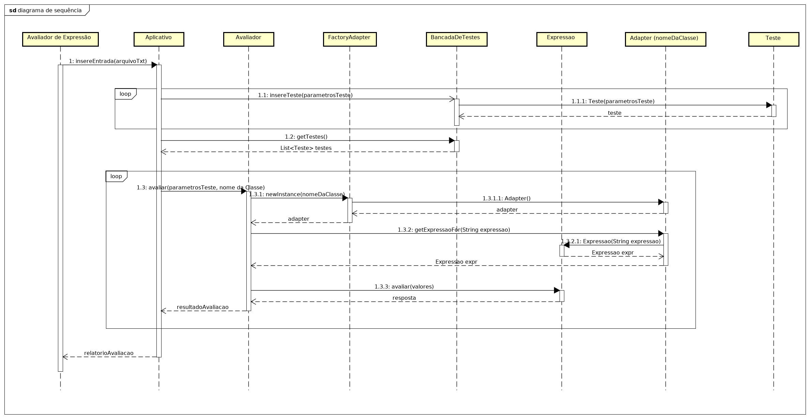

# Design detalhado: Benchmark para avaliadores de expressões matemáticas

Além de permitir validar uma implementação de um avaliador de expressões, 
o presente _benchmark_ também considera relevante outros aspectos:

- Desempenho: Tempo gasto para avaliação de uma expressão.
- Memória: Consumo de memória incorrido ao avaliar expressões.
- Latência: Tempo gasto para pré-processamento de uma expressão, caso  exista esta opção, sem incluir o tempo consumido
 na avaliação da expressão.
- Carga: Tempo gasto para avaliação de diversas expressões, simulando a utilização extrema do avaliador para observar 
o seu comportamento em situações de estresse.
- Precisão: Se a precisão do resultado obtido pelo avaliador de expressões atende ao epsilon exigido como precisão. 

Este benchmark foi pensado para abordar os cincos critérios de avaliação por meio do padrão de projeto Strategy, havendo
uma interface _Avaliador_ e as três classes que a implementam: _ConsumoMemoria_, _Desempenho_ e _Latencia_.

Os critérios de carga e precisão foram definidos como preliminares a qualquer um dos três tipos de critérios de avaliação
acima. 

A precisão é abordada como um parâmetro que deve ser informado juntamente com a própria expressão, os valores de
suas variáveis e o resultado. A comparação do resultado obtido com o esperado é realizada considerando o intervalo de 
precisão informado.

O critério de carga também é abordado de maneira integrada aos demais critérios. Justamente com os quatro parâmetros
citados acima, a quantidade de repetições também deve ser informada a cada caso de teste inserido. Com isso, o intuito
é dar autonomia ao Avaliador devido a possibilidade de personalizar a avaliação da carga.

Ao decorrer do documento, todos esse pontos são explicados detalhadamente, com [exemplos de implementação](projeto/).

 ### Conceitos fundamentais

  #### Avaliador de Expressão  
  - Biblioteca ou serviço que implementa a avaliação de expressões matemáticas. 

  #### Adaptador
  - Código responsável por requisitar a avaliação de expressões matemáticas pelo Avaliador. Deve ser produzido um 
  adaptador para cada Avaliador de Expressão. 

 ### Fluxo principal de funcionamento:

  ##### 01
   - A partir do nome da classe é obtida uma instância de _Adapter_. 
    
  ##### 02   
   - Para cada linha de teste do arquivo de entrada, um instância de _Teste_ é criada em _BancadaDeTestes_. 
    
  ##### 03
   - Para cada _Teste_ retornado pela instância de _BancadaDeTestes_, por meio do método _get_, 
   obtém-se a expressão correspondente, a partir da qual, por meio da instância de _Adapter_ obtém-se a instância de 
   _Expressao_ correspondente. 
    
  ##### 04
  - Este último objeto recebe a mensagem _avaliacao_ cujo argumento é o conjunto de valores. O retorno é verificado
    com aquele do teste. 
  - Se o valor retornado difere do esperado, então o caso de teste retorna um valor correspondete ao erro.    
  - Ao final, o benchmark retorna um arquivo txt contendo o relatório da avaliação realizada.  

### Validação da correção

A validação da correção de uma implementação será fornecida por meio de um arquivo CSV contendo cinco colunas, na ordem 
descrita abaixo:

- Variáveis: Valores das variáveis a serem utilizadas na avaliação da expressão  serão fornecidas separadas por vírgula.
 Por exemplo, para a expressão acima podemos ter x=10. Se a expressão faz uso de mais de uma variável, então os valores
 devem ser separados por vírgula. Por exemplo, para a expressão "a + b", os valores das variáveis podem ser 
 "a=1,b=3.4", por exemplo.
 
- Expressão: Por exemplo, 2*(3-x).

- Resultado: O valor da expressão. Por exemplo, para a expressão acima e o  valor de x igual a 10 (x=10), o resultado 
é -14. Caso a expressão seja inválida, então o resultado deve ser a  sequência "ERRO". Por exemplo, se a  expressão 
fornecida é "2*)", então o resultado deve ser "ERRO", pois não se trata de uma expressão válida. 

- Quantidade de repetições: A quantidade de vezes que o mesmo caso de teste deve ser efetuado. É necessário que o valor
mínimo seja 1, caso contrário, a avaliadar não será executada e o valor retornado para o teste em questão será 
-1, que indica que a avaliação não foi executada.

- Intervalo de precisão: Deve-se especificar qual o intervalo máximo tolerável de divergência entre a resposta dada pelo
Avaliador de Expressão e o resultado esperado.


#### Exemplo do conteúdo do arquivo CSV com os casos de teste: 
  
<!--
  |   Expressão   |  Variáveis  |    Resultado    |    Repetições   |     Precisão    |
  |     :---:     |     :---:   |       :---:     |       :---:     |       :---:     |
  | 2*(3-x)       |      x=5    |         -4      |          1      |         0.1     |
  | x+y/2         | x=2,y=10    |          7      |          3      |         0.1     |
  | (x-z)*(y-x/z) | x=5,y=6,z=2 |         10,5    |          1      |         0.1     |
  | x^x           |      x=3    |         27      |          1      |         0.1     |
  | x^x/2         |      x=2    |         2       |          500    |         0.1     |
--> 

  |               |             |                 |                 |                 |
  |     :---:     |     :---:   |       :---:     |       :---:     |       :---:     |
  | 2*(3-x)       |      x=5    |         -4      |          1      |         0.1     |
  | x+y/2         | x=2,y=10    |          7      |          3      |         0.1     |
  | (x-z)*(y-x/z) | x=5,y=6,z=2 |         10,5    |          1      |         0.1     |
  | x^x           |      x=3    |         27      |          1      |         0.1     |
  | x^x/2         |      x=2    |         2       |          500    |         0.1     |


### Classes esperadas

- Toda implementação a ser avaliada pelo presente _benchmark_ deve incluir as classes/interfaces identificadas abaixo.

- Foi adotado o padrão de projeto Strategy para abordar os três tipos possíveis de avaliação (desempenho, consumo de 
memória e latência), conforme o diagrama de classes abaixo:


- O benchmark deve ser implementado de acordo com o diagrama de sequência e demais instruções abaixo:



#### [Aplicativo](src/Aplicativo.java) (classe)
Ponto de entrada para execução do _benchmark_. A classe deve ser implementada seguindo o fluxo esperado abaixo:

1) Esta classe recebe como entrada um arquivo txt indicando o que deverá ser executado pelo _benchmark_. Cada uma 
das informações abaixo deve contar em uma linha distinta.

- Nome da classe que implementa o adaptador (String nomeDaClasse)
- Caminho do diretório contendo o nome do arquivo CSV que contém os testes (String caminhoArquivoCsv;).
- Código de um dos três tipos de avaliação desejado (String codigoTipoAvaliacao):
    (1) Desempenho;
    (2) Consumo de memória;
    (3) Latência.
- Caminho do diretório onde o relatorioResultado.txt deve ser escrito (String caminhoRelatorioResultado).

##### Exemplo de arquivo txt de entrada:
        
        /home/argos/Desktop/AvaliadorMatematico/src/AdapterInstantiator.java
        testes.csv
        3
        /home/argos/Desktop/        
        
2) Em seguida, a classe Aplicativo deverá acessar o arquivo.csv e converter cada linha em parâmetros que serão enviados
para _BancadaDeTestes_ para que ela crie e armazene uma instância de _Teste_. 

3) Ao final das instanciações dos testes, a classe _BancadaDeTestes_ retorna um List<Teste> testes.

4) O Aplicativo então, de acordo com o codigoTipoAvaliacao, acessa a implementação da interface _Avaliador_ 
correspondente, e executa o método avaliar() da implementação.

5) A implementação do _Avaliador_ irá realizar as operações de instanciação conforme o diagrama de sequências contido
acima. No final de cada utilização do método avaliar(), ela retorna o resultado da avaliação.

6) Cada resultado retornado é armazenado na List<String> resultados, indexando os resultados na ordem que aparecem no
arquivo.csv.

7) Ao final dos acessos ao método avalia(), a lista de resultados é convertida em um arquivo relatorioAvaliacao.txt,
que é escrito no caminho informado pelo Avaliador de Expressão.

Detalhes do relatorioAvaliacao.txt: O resultado de cada teste é dado na mesma linha em que o teste aparece no arquivo 
CSV. Este resultado deve indicar, respectivamente ao tipo de avaliação:
    (1) Desempenho: o tempo gasto na execução de cada um dos testes (linha de teste do arquivo de entrada);
    (2) Consumo de memória: a memória gasta na execução de cada um dos testes;
    (3) Latência: a latência (tempo de execução do método getExpressaoFor) antes da execução de cada teste.
    
##### Exemplo de arquivo txt de saída no caso de teste de desempenho:
        
        TESTE DE DESEMPENHO
        
        1. 116 ms
        2. 34 ms
        3. 42 ms
        4. 35 ms
        5. 41 ms
        6. 33 ms   
        
##### Exemplo de arquivo txt de saída no caso de teste de latência:
        
        TESTE DE DESEMPENHO
        
        1. 416 ms
        2. 334 ms
        3. 422 ms
        4. 345 ms
        5. 451 ms
        6. 363 ms   
        
##### Exemplo de arquivo txt de saída no caso de teste de consumo de memória:
        
        TESTE DE DESEMPENHO
        
        1. 45454 bytes
        2. 22234 bytes
        3. 12233 bytes
        4. 23423 bytes
        5. 55443 bytes
        6. 9894 bytes  
        

#### [Expressao](src/adaptador/Expressao.java) (interface)
Esta interface deve possuir o método _avaliar_. Essa interface deve ser implementada pelo Avaliador de Expressão.

#### [Adapter](src/adaptador/Adapter.java) (interface)
Esta interface possui o método _Expressao getExpressaoFor(String expressao)_. A execução deste método inclui a 
preparação da expressão fornecida, caso exista, antes que seja executada. Essa interface deve ser implementada pelo 
Avaliador de Expressão.

#### [FactoryAdapter](src/adaptador/FactoryAdapter.java) (classe)
Produz uma instância de _Adapter_ por meio do método _newInstance(String nomeDaClasse)_.

#### [Teste](src/test/Teste.java) (classe)
Uma instância desta classe possui uma expressão (String), um valor para cada uma das variáveis empregadas na expressão, 
o resultado correspondente, a quantidade de repetições e o intervalo de precisão exigido. 

#### [BancadaDeTestes](src/test/BancadaDeTestes.java) implements Supplier<Teste>
O construtor recebe como argumento o nome de um arquivo CSV cujas cinco colunas são, nesta ordem: 

 (a) Variáveis.
 (b) Expressão.
 (c) Resultado.
 (d) Quantidade de repetições.
 (e) Intervalo de precisão.

O método _get_ será empregado para recuperar, um por um, na ordem em que aparecem no arquivo CSV, os testes contidos 
neste arquivo. 

#### [AvaliadorConsumoMemoria](src/avaliadores/ConsumoMemoria.java) (classe)
- Classe que verifica o consumo de memória da implementação do Avaliador de Expressão durante a avaliação de uma expressão. A
ferramenta utilizada na verificação do consumo de memória são as funções _totalMemory()_ e _freeMemory()_, ambas da 
classe [Runtime](https://docs.oracle.com/javase/7/docs/api/java/lang/Runtime.html) (clique para abrir a documentação da 
classe). As funções podem ser usadas como abaixo:

    ````java
    Runtime runtime = Runtime.getRuntime();
    
    long memoriaUtilizadaAntes = runtime.totalMemory() - runtime.freeMemory();  
    double resposta = exp.avaliar(variaveis);
    long memoriaUtilizadaDepois = runtime.totalMemory() - runtime.freeMemory(); 
    long memoriaUtilizada = memoriaUtilizadaDepois - memoriaUtilizadaAntes;
    ```` 

#### [AvaliadorDesempenho](src/avaliadores/Desempenho.java) (classe)
- Classe que avalia o desempenho da implementação do Avaliador de Expressão durante a avaliação de uma expressão. O desempenho 
consiste no intervalo de tempo entre o início e o final da avaliação a expressão, e só é considerado caso a resposta
seja compatível com o resultado esperado. A ferramenta utilizada na avaliação será o método _CurrentTimeMillis()_, da
classe [System](https://docs.oracle.com/javase/7/docs/api/java/lang/System.html) (clique para abrir a documentação da 
classe), conforme o exemplo abaixo:

    ````java
    long inicio = System.currentTimeMillis();
    double resposta = exp.avaliar(variaveis);
    long termino = System.currentTimeMillis();
    long tempoEmMilissegundo = termino - inicio;
    ````

#### [AvaliadorLatencia](src/avaliadores/Latencia.java) (classe)
- Classe que avalia a latência do Avaliador de Expressão antes a avaliação de uma expressão. A latência se caracteriza como o período
de tempo gasto na execução do método _preparar()_ que deve estar presente na interface Adapter. A forma de verificação
desse intervalo de tempo também pode ser o método _CurrentTimeMillis()_, da classe System.

<!--

#### Cenários

##### 1 Constante 1
A expressão formada apenas deste dígito 1 é executada 10, 100, 1000, 10.000, 100.000 e 1.000.000 de vezes, produzindo 
seis valores. 

##### 2 Constante -12.45678

Idem do anterior. 

-->

